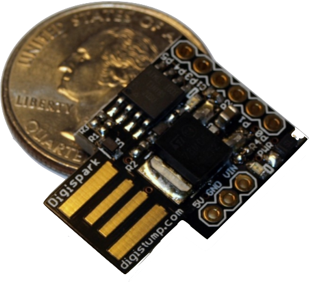

# scripted USB
Pre-program a usb keyboard with just the right keystrokes

  

## Setup
1. Obtain a disgipark development board, available [here](https://www.ebay.com/sch/i.html?_nkw=digispark)
2. [Code your own digispark](https://github.com/BarakBinyamin/scriptedUSB/blob/main/arduinoSketches/autoHIDexample/autoHIDexample.ino) in an [arduino IDE](https://www.arduino.cc/en/software)

## Resources
- [Digistump Arduino](https://github.com/digistump/DigistumpArduino)
- [Setup to skip mac keyboard setup](https://null-byte.wonderhowto.com/how-to/hack-macos-with-digispark-ducky-script-payloads-0198555/)
- [Where are arduino libraries stored](https://support.arduino.cc/hc/en-us/articles/4415103213714-Find-sketches-libraries-board-cores-and-other-files-on-your-computer)
- [Char code references](https://github.com/digistump/DigistumpArduino/blob/master/digistump-avr/libraries/DigisparkKeyboard/DigiKeyboard.h)
- Check your work, and see what keys are pressed at [https://keyboardchecker.com/](https://keyboardchecker.com/)
- [Asci art generator](https://patorjk.com/software/taag/#p=display&h=0&v=0&f=3D-ASCII&t=Hello), favorites are train and 3D ascii
- [Upgrade bootloader to drop the delay](http://digistump.com/board/index.php/topic,320.msg1711.html#msg1711)
