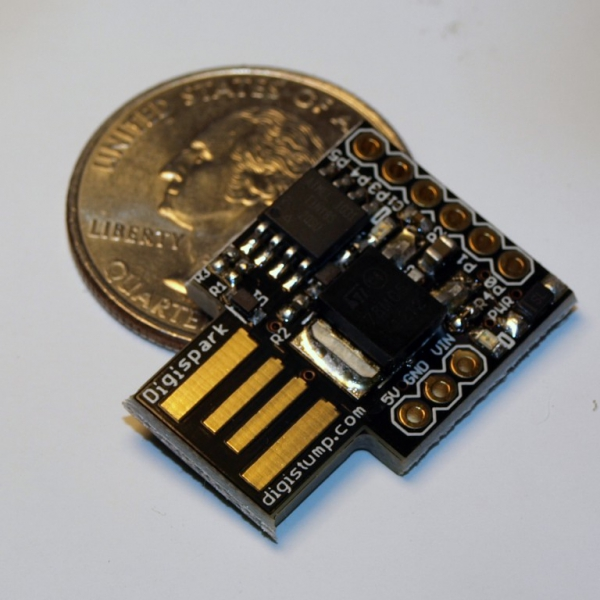

# scripted USB
Pre-program a usb keyboard with just the right keystrokes

  

### Directory    
1. [Setup](#setup)
2. [Resources](#resources)

## Setup
1. Obtain a disgipark scriptable keyboard, available [here](https://www.ebay.com/sch/i.html?_nkw=digispark)
2. Code your own digispark in an arduino IDE 
 <--gif of steps here-->
4. Edit digistump source, this allows the digispark usb to work automatically for mac, without the keyboard setup
 <--gif of steps here-->

## Resources
- [Setup to skip mac keyboard setup](https://null-byte.wonderhowto.com/how-to/hack-macos-with-digispark-ducky-script-payloads-0198555/)
- [Char code references](https://github.com/digistump/DigistumpArduino/blob/master/digistump-avr/libraries/DigisparkKeyboard/DigiKeyboard.h)
- Check your work, and see what keys are pressed at [https://keyboardchecker.com/](https://keyboardchecker.com/)
